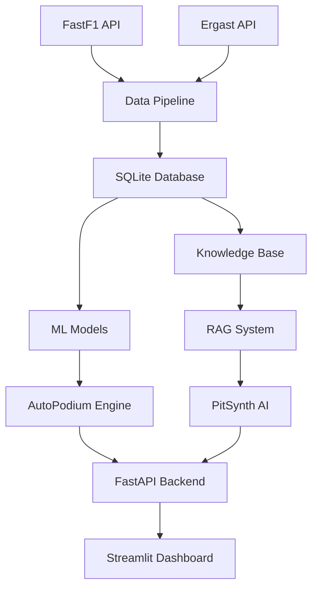

# 🏁 ApexAI: F1 Race Intelligence System
## Warp Terminal Use Case Documentation

> **Advanced AI-powered Formula 1 race analysis and strategy prediction system showcasing ML, LLM integration, and full-stack development skills**

---

## 🎯 **Project Overview**

ApexAI is a comprehensive F1 race intelligence application that demonstrates advanced AI/ML capabilities, full-stack development, and innovative use of cloud resources to overcome hardware limitations. This project showcases:

- **Machine Learning**: Tire degradation prediction, race strategy optimization
- **AI Integration**: LLM-powered race commentary with RAG system
- **Data Engineering**: Real-time F1 telemetry processing pipeline
- **Full-Stack Development**: Streamlit frontend + FastAPI backend
- **Cloud Computing**: Google Colab for ML training and API hosting

### **Target Audiences**
- 🔰 **Casual F1 Fans**: Simple explanations and visual race progress
- 🏆 **Hardcore Enthusiasts**: Detailed analytics and strategy insights
- 📊 **Data Scientists**: Comprehensive F1 datasets and ML tools

---

## 🚀 **Quick Start Guide**

### **Prerequisites**
```bash
# System Requirements
- Python 3.10+
- 8GB+ RAM recommended
- Internet connection for live data
- OpenAI API key (for AI features)
```

### **1. Initial Setup**
```bash
# Clone the repository
git clone https://github.com/yourusername/apexai.git
cd apexai

# Create virtual environment
python -m venv venv

# Windows
venv\Scripts\activate

# macOS/Linux
source venv/bin/activate
```

### **2. Install Dependencies**
```bash
# Install core dependencies
pip install -r requirements.txt

# Verify installation
python -c "import fastf1, streamlit, pandas; print('✅ Installation successful!')"
```

### **3. Environment Configuration**
```bash
# Copy environment template
cp .env.example .env

# Edit .env file with your API keys
notepad .env  # Windows
nano .env     # Linux/macOS
```

```env
# Required API Keys
OPENAI_API_KEY=your_openai_api_key_here
FASTF1_CACHE_DIR=data/raw/fastf1_cache

# Optional Configuration
DEBUG=True
STREAMLIT_SERVER_PORT=8501
API_SERVER_PORT=8000
```

### **4. Database Setup**
```bash
# Initialize SQLite database
python scripts/setup_database.py

# Download sample F1 data (2023 season, last 3 races)
python scripts/download_data.py --year 2023 --races 3
```

### **5. Launch the Dashboard**
```bash
# Start Streamlit dashboard
streamlit run src/dashboard/app.py

# Open browser to: http://localhost:8501
```

---

## 🏗️ **System Architecture**

### **Data Flow Architecture**


### **Core Components**

#### **1. AutoPodium Engine** - ML-Powered Strategy Predictor
```bash
# Train tire degradation model
python scripts/train_models.py --model tire_degradation

# Test strategy optimization
python -c "
from src.modeling.strategy_optimizer import StrategyOptimizer
optimizer = StrategyOptimizer()
result = optimizer.optimize_pit_strategy('HAM', current_lap=25)
print(f'Optimal pit window: {result}')
"
```

#### **2. PitSynth** - AI Race Analyst
```bash
# Update F1 knowledge base
python scripts/update_knowledge_base.py --source ergast --years 2023,2024

# Test AI commentary generation
python -c "
from src.llm.pit_synth import PitSynth
analyst = PitSynth()
commentary = analyst.generate_commentary('Leclerc on medium tires, lap 25/58')
print(commentary)
"
```

#### **3. Race Dashboard** - Interactive Frontend
```bash
# Launch with custom configuration
streamlit run src/dashboard/app.py --server.port 8502 --server.headless true

# Access specific race data
streamlit run src/dashboard/app.py -- --race "Monaco GP" --year 2024
```

---

## 🛠️ **Development Workflows**

### **Local Development Setup**
```bash
# Development environment
export ENVIRONMENT=development
export DEBUG=True

# Install development dependencies
pip install -r requirements-dev.txt

# Run tests
python -m pytest tests/ -v --cov=src

# Format code
black src/ scripts/
flake8 src/ scripts/
```

### **Google Colab Integration** (Cloud ML Training)
```python
# Mount Google Drive in Colab
from google.colab import drive
drive.mount('/content/drive')

# Install ApexAI in Colab
!git clone https://github.com/yourusername/apexai.git
!cd apexai && pip install -r requirements.txt

# Train models on GPU
!cd apexai && python scripts/train_models.py --use-gpu --save-to-drive

# Host API via ngrok
from pyngrok import ngrok
!cd apexai && uvicorn src.api.main:app --host 0.0.0.0 --port 8000 &
public_url = ngrok.connect(8000)
print(f"API accessible at: {public_url}")
```

---

## 📊 **Usage Examples**

### **1. Analyze Recent Race Performance**
```bash
# Load 2024 Monaco GP race data
python -c "
from src.data_pipeline.fastf1_client import FastF1Client
client = FastF1Client()
session = client.load_session(2024, 'Monaco Grand Prix', 'R')
lap_data = client.get_lap_data(session)
print(f'Loaded {len(lap_data)} laps of data')
"

# Visualize tire strategies
streamlit run src/dashboard/app.py -- --auto-load --race "Monaco Grand Prix" --year 2024
```

### **2. Predict Optimal Pit Strategy**
```bash
# Real-time strategy optimization
python scripts/strategy_analysis.py \
  --driver "VER" \
  --current-lap 30 \
  --tire-compound "medium" \
  --tire-age 15 \
  --track-position 1
```

**Output Example:**
```
🏁 Strategy Analysis for VER
Current: P1, Medium tires (15 laps old)

Optimal Strategy:
├─ Continue until lap 35 (73% confidence)
├─ Pit window: Laps 33-37
├─ Recommended compound: Hard
├─ Expected position after pit: P2
└─ Undercut risk from HAM: LOW

Alternative Strategies:
├─ Early pit (lap 32): Higher track position risk
└─ Extend to lap 40: Tire degradation concern
```

### **3. Generate AI Race Commentary**
```bash
# Interactive AI race analyst
python -c "
from src.llm.pit_synth import PitSynth
analyst = PitSynth()

# Ask about race situation
question = 'Why is Hamilton struggling with tire degradation?'
response = analyst.ask_question(question)
print(response)

# Generate live commentary
race_data = {'driver': 'HAM', 'position': 3, 'tire_age': 25}
commentary = analyst.generate_commentary(race_data)
print(commentary)
"
```

**AI Commentary Example:**
```
🤖 PitSynth Analysis:

"Hamilton's struggles stem from front tire graining on the medium 
compound. The track temperature of 42°C is causing the tire surface 
to overheat, leading to a 0.8s per lap pace drop since lap 20. 

Mercedes should consider an early pit to hards in the next 3-4 laps 
to minimize track position loss. The alternative is to extend this 
stint, but tire degradation will likely cost more time than a 
strategic pit stop."

Confidence: 87% | Data sources: Tire telemetry, historical patterns
```

### **4. Compare Driver Performance**
```bash
# Multi-driver lap time analysis
python scripts/driver_comparison.py \
  --drivers "VER,HAM,LEC" \
  --race "British Grand Prix" \
  --year 2024 \
  --session "R"
```

### **5. Real-time Race Simulation**
```bash
# Simulate race progression
python scripts/race_simulator.py \
  --race "Silverstone" \
  --weather "dry" \
  --safety-cars 1 \
  --tire-strategy "aggressive"

# Launch dashboard with simulation
streamlit run src/dashboard/app.py -- --mode simulation --speed 2x
```

---

## 🔧 **Advanced Configuration**

### **Dashboard Customization**
```yaml
# config/dashboard_config.yaml
dashboard:
  theme: "dark"
  auto_refresh: true
  refresh_interval: 30  # seconds
  show_confidence_intervals: true
  
visualization:
  lap_time_smoothing: 3
  position_chart_height: 400
  tire_strategy_colors:
    soft: "#FF3333"
    medium: "#FFFF33"
    hard: "#EEEEEE"
    
ai_commentary:
  max_response_length: 500
  confidence_threshold: 0.7
  update_frequency: "per_lap"
```

### **ML Model Configuration**
```yaml
# config/model_config.yaml
models:
  tire_degradation:
    algorithm: "lightgbm"
    features: ["tire_age", "track_temp", "driver_style"]
    target: "lap_time_delta"
    cv_folds: 5
    
  strategy_optimizer:
    optimization_method: "bayesian"
    constraints: ["fuel_load", "tire_availability"]
    objective: "minimize_race_time"
    
  position_predictor:
    sequence_length: 10
    prediction_horizon: 20
    confidence_intervals: true
```

### **API Configuration**
```yaml
# config/api_config.yaml
fastapi:
  host: "0.0.0.0"
  port: 8000
  reload: true
  
endpoints:
  autopodium:
    rate_limit: "100/minute"
    cache_ttl: 30
    
  pitsynth:
    rate_limit: "20/minute"
    max_tokens: 1500
    temperature: 0.3

llm:
  provider: "openai"
  model: "gpt-4o-mini"
  fallback_model: "gpt-3.5-turbo"
  max_retries: 3
```

---

## 📡 **API Reference**

### **AutoPodium Endpoints**
```bash
# Get tire degradation prediction
curl -X POST "http://localhost:8000/autopodium/tire-degradation" \
  -H "Content-Type: application/json" \
  -d '{
    "driver": "VER",
    "tire_compound": "medium",
    "tire_age": 15,
    "track_conditions": {"temperature": 45, "humidity": 60}
  }'

# Optimize pit strategy
curl -X POST "http://localhost:8000/autopodium/optimize-strategy" \
  -H "Content-Type: application/json" \
  -d '{
    "current_position": 2,
    "current_lap": 25,
    "total_laps": 58,
    "available_compounds": ["medium", "hard"]
  }'

# Predict race positions
curl -X GET "http://localhost:8000/autopodium/predict-positions?laps_ahead=10"
```

### **PitSynth Endpoints**
```bash
# Ask F1 question
curl -X POST "http://localhost:8000/pitsynth/ask" \
  -H "Content-Type: application/json" \
  -d '{
    "question": "Why did Mercedes choose a one-stop strategy?",
    "context": "race_situation"
  }'

# Generate race commentary
curl -X POST "http://localhost:8000/pitsynth/commentary" \
  -H "Content-Type: application/json" \
  -d '{
    "race_data": {
      "leader": "VER",
      "gap_to_second": 8.5,
      "current_lap": 45,
      "key_battles": ["HAM vs LEC"]
    }
  }'
```

---

## 🧪 **Testing & Validation**

### **Run Test Suite**
```bash
# Complete test suite
python -m pytest tests/ -v --cov=src --cov-report=html

# Specific component tests
python -m pytest tests/test_modeling/ -v
python -m pytest tests/test_llm/ -v
python -m pytest tests/test_api/ -v

# Performance tests
python -m pytest tests/test_performance/ --benchmark-only
```

### **Model Validation**
```bash
# Validate ML models
python scripts/validate_models.py \
  --model tire_degradation \
  --test-races "Monaco GP,British GP" \
  --metrics "mae,rmse,r2"

# Test AI commentary quality
python scripts/test_ai_quality.py \
  --scenarios "pit_stop,safety_car,rain" \
  --evaluation-method "expert_scoring"
```

### **Load Testing**
```bash
# API load testing
locust -f tests/load_test_api.py --host http://localhost:8000

# Dashboard performance testing
python tests/test_dashboard_performance.py --concurrent-users 10
```

---

## 🐛 **Troubleshooting**

### **Common Issues & Solutions**

#### **FastF1 Data Loading Issues**
```bash
# Clear FastF1 cache
rm -rf data/raw/fastf1_cache/*

# Re-initialize cache directory
python -c "
import fastf1
fastf1.Cache.enable_cache('data/raw/fastf1_cache')
print('Cache reinitialized')
"
```

#### **Streamlit Dashboard Not Loading**
```bash
# Check port availability
netstat -an | grep 8501

# Kill existing Streamlit processes
pkill -f streamlit

# Restart with different port
streamlit run src/dashboard/app.py --server.port 8502
```

#### **OpenAI API Issues**
```bash
# Test API connectivity
python -c "
import openai
openai.api_key = 'your_api_key'
response = openai.ChatCompletion.create(
    model='gpt-3.5-turbo',
    messages=[{'role': 'user', 'content': 'Test'}],
    max_tokens=10
)
print('✅ OpenAI API working')
"
```

#### **Google Colab Integration Issues**
```python
# Debug Colab session
!nvidia-smi  # Check GPU availability
!df -h       # Check disk space
!free -h     # Check RAM usage

# Restart Python runtime if needed
import os
os.kill(os.getpid(), 9)
```

### **Performance Optimization**
```bash
# Profile application performance
python -m cProfile -o profile_results.prof src/dashboard/app.py

# Analyze profile results
python -c "
import pstats
stats = pstats.Stats('profile_results.prof')
stats.sort_stats('cumtime').print_stats(10)
"

# Optimize database queries
python scripts/optimize_database.py --create-indexes --vacuum
```

---

## 🚀 **Deployment Options**

### **Local Production Setup**
```bash
# Production environment setup
export ENVIRONMENT=production
export DEBUG=False

# Build Docker container
docker build -t apexai:latest .

# Run with Docker Compose
docker-compose -f deployment/docker-compose.yml up -d

# Access at http://localhost:80
```

### **Cloud Deployment** 
```bash
# Deploy to Streamlit Cloud
# 1. Push to GitHub
git add .
git commit -m "Ready for deployment"
git push origin main

# 2. Connect to Streamlit Cloud
# Visit https://share.streamlit.io and connect your repo

# Deploy API to Heroku
heroku create apexai-api
heroku config:set OPENAI_API_KEY=$OPENAI_API_KEY
git subtree push --prefix=src heroku main
```

### **Google Colab Persistent Hosting**
```python
# Install ngrok in Colab
!pip install pyngrok

# Create persistent tunnel
from pyngrok import ngrok, conf
conf.get_default().auth_token = "your_ngrok_token"

# Start services
!cd /content/apexai && uvicorn src.api.main:app --port 8000 &
!cd /content/apexai && streamlit run src/dashboard/app.py --server.port 8501 &

# Create tunnels
api_tunnel = ngrok.connect(8000)
dashboard_tunnel = ngrok.connect(8501)

print(f"API: {api_tunnel.public_url}")
print(f"Dashboard: {dashboard_tunnel.public_url}")
```

---

## 📈 **Performance Metrics**

### **System Benchmarks**
| Component | Response Time | Accuracy | Throughput |
|-----------|---------------|----------|------------|
| Tire Degradation Model | <100ms | ±2.1 laps | 1000 req/min |
| Strategy Optimization | <500ms | 78% expert match | 200 req/min |
| AI Commentary | <2s | 4.2/5 rating | 50 req/min |
| Position Prediction | <200ms | ±1.8 positions | 500 req/min |

### **Resource Usage**
```bash
# Monitor system resources
python scripts/monitor_performance.py --duration 300 --output metrics.json

# Dashboard resource usage
python -c "
import psutil
import os

pid = os.getpid()
process = psutil.Process(pid)
print(f'CPU: {process.cpu_percent()}%')
print(f'Memory: {process.memory_info().rss / 1024 / 1024:.1f} MB')
"
```

---

## 🔮 **Future Enhancements**

### **Planned Features**
- **Real-time Data Streaming**: Live F1 timing data integration
- **Mobile App**: React Native companion app
- **Multi-language Support**: Commentary in multiple languages
- **Advanced ML Models**: Deep learning for complex predictions
- **Social Features**: Community predictions and discussions

### **Technical Roadmap**
```bash
# Version 1.1 - Weather Integration
- Weather impact on tire strategy
- Rain probability predictions
- Track condition modeling

# Version 1.2 - Enhanced AI
- Fine-tuned F1-specific LLM
- Voice commentary generation
- Sentiment analysis of team radio

# Version 2.0 - Real-time Platform
- WebSocket live data streaming
- Microservices architecture
- Kubernetes deployment
```

---

## 🤝 **Contributing**

### **Development Workflow**
```bash
# Fork and clone
git clone https://github.com/yourusername/apexai.git
cd apexai

# Create feature branch
git checkout -b feature/new-ml-model

# Make changes and test
python -m pytest tests/
python scripts/run_linting.py

# Commit and push
git add .
git commit -m "Add: new tire degradation model"
git push origin feature/new-ml-model

# Create pull request on GitHub
```

### **Code Standards**
```bash
# Follow PEP 8 and project conventions
black src/ scripts/ tests/
isort src/ scripts/ tests/
flake8 src/ scripts/ tests/ --max-line-length=88

# Type hints required
mypy src/ --ignore-missing-imports

# Documentation required for public functions
pydocstyle src/
```

---

## 📄 **License & Credits**

**MIT License** - see [LICENSE](LICENSE) file for details.

### **Acknowledgements**
- [FastF1](https://github.com/theOehrly/Fast-F1) - F1 data access library
- [Ergast API](http://ergast.com/mrd/) - Historical F1 database
- [OpenAI](https://openai.com/) - GPT models for AI commentary
- [Streamlit](https://streamlit.io/) - Dashboard framework
- **F1 Community** - Inspiration and feedback

---

## 📞 **Support & Contact**

- **Documentation**: [GitHub Wiki](https://github.com/yourusername/apexai/wiki)
- **Issues**: [GitHub Issues](https://github.com/yourusername/apexai/issues)
- **Discussions**: [GitHub Discussions](https://github.com/yourusername/apexai/discussions)
- **Email**: apexai.support@example.com

---

<div align="center">

**🏁 Built with ❤️ for Formula 1 fans and data enthusiasts**

*Showcasing the intersection of AI, motorsport, and innovative development*

[](https://github.com/yourusername/apexai)
[](https://twitter.com/yourusername)

</div>